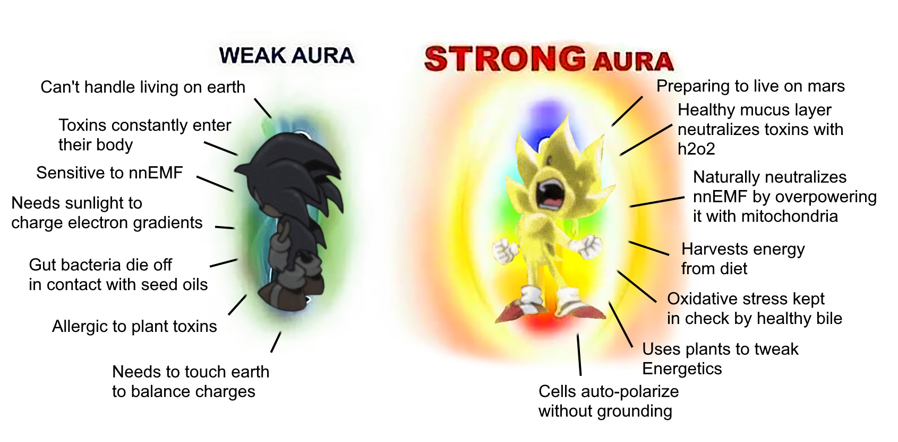

## Have you tried to levitate as a means to solving the problem, anon?

(this post was originally a thread on Bluesky: [On Steelmanning Reiki & Energy Healing.](https://bsky.app/profile/ultimape.bsky.wovensoup.com/post/3k6nvgovryu2g) )

----

Contemplating what it means to levitate by studying Dainichi Nyorai, the Goddess of light. Unifying the fundamental forces of the universe, this.

> "Releasing the Yinyang essence served as the basis for the creation of The Grand Supreme Dark Kais infamous Dainichi Nyorai Technique."
> [fandom: DBZ universe 'Inyo'](https://dbzuniverse.fandom.com/wiki/Inyo)

In other news, I believe steelmanned Reiki. I think I can achieve touch based healing by 'channeling aetheric energy' into charges along another's Meridians and use it to recruit immune cells to a site. [Electricity Helps Heal Wounds (youtube)](https://www.youtube.com/watch?v=BcT_4VqXhRs)

I am obsessed with magic. Like stage magic. James Randi was friends with Richard Feynman. They would talk about magic tricks. [Feynman had fun figuring out how Randi did things (youtube, audio loud)](https://www.youtube.com/watch?v=lDvu6wz9qF4) Randi exposed faith healers. The best magic trick to trick a magician who can spot the wires of levitation is to litterally learn how to fly. The trick that isn't...

Most of the people doing Reiki to prove it to scientist are liars using tricks. They swap out dead chickens with live ones using slight of hand. They say they can't do it while being watched. It's like a magician's misdirection step. They put the chicken into mesmerized state and then hide it up their ass or something.

But I think Reiki should be possible. How can I hold these discongruent views and still be a fan of Randi and his work on [Homeopathy, quackery and fraud](https://www.ted.com/talks/james_randi_homeopathy_quackery_and_fraud)? Because I don't think this is a supernatural power. I suspect it's basic science. And that most are doing it wrong.

I think this is an application of bioelectricity. Imagine it. Comes in handy sometimes. Consider [Richard Feynman on Electricity (youtube)](https://www.youtube.com/watch?v=kS25vitrZ6g)

Injured cellular matrixes (skin in particular) induce a negative charge due to the disruption of normal ion channels (TRPs mostly). It's very small ~50mV. Immune cells are attracted to this charge. It guides them to the site. If they are functioning well they perform healing processes. Much of these TRPs, ones that are hit by terpenes, are piezoelectric in nature and may need to be functioning well to induce this charge. If this is what is going on, and these ancient healing techniques have an ounce of credibiilty, then Reiki / Acupuncture are about channeling electrostatic charge of earth into the body to guide and direct cells to certain spots. The same kind of charges lightning comes from. They call it "universal energy". It's just electricity.

Channeling Chi is about learning to feel and manipulate these slight gradients. Tai Chi is a training regimen to feel it in your hands. Tai Chi "energy ball" is sensing a repulsive field of the body acting like a piezoelectric generator. The movements are to build up static charge. C-tactile fibers are very dense in the hand, but you need a charge built up to feel another charge. It feels like a ball when your hand have a slight charge. There also ought to be a meditation that can change minute charges in hands that would be perceived as a glowing to people w/ sensitive eyes.

It is likely a synesthesia between hands + eyes. You would need time to train sensitivity in hands as well as train the eyes. And then further time to learn how to feel it in the body. Tetrachromatic vision can perceive blood flow, so energy healing is enhanced in those who can see that kind of light. And who knows, maybe you can see a real glow too if your diet is right. [You Can't See It, But Humans Actually Glow With Our Own Form of Bioluminescence](https://www.sciencealert.com/you-can-t-see-it-but-humans-actually-glow-in-visible-light)

Fixing my gut fixed my ability to regulate temperature. My mind would send the signal to my immune system, but nothing would respond. I wasn't able to manipulate my body temp thru Tummo via mental state until I both had training AND the gut bacteria that can get the body to warm up. Awaken this.

The bacteria help w/ metal metabolism, & w/ fats+oils. The blood is salty and full of metals. The skin is oily. The chemicals they make hit TRP receptors all over. If you squint, we are electrolytic capacitors, constantly charging ourselves & balancing electrical energy. If healthy and eat well (aka provided gut health is good), one's "aura" would be the em field charge that occurs from digestion. The stomach absorbs bile / sodium into the blood and then around to the circulatory system & eventually back to the liver/kidney, to be reexcreted thru the gut back into into the colon. It's cyclic. Hypothetically, those who can train this synesthetic sense would "hallucinate" colors that reflects the state of this in others by picking up on minute changes in smell and skin flushness.

It's like we are tiny mirror images of the earth's oceans.

> "When salty ocean water flows through the magnetic field, an electric current is generated and this, in turn, induces a magnetic response in the deep region below Earth's crust – the mantle."
> [Magnetic oceans and electric Earth](https://phys.org/news/2016-10-magnetic-oceans-electric-earth.html)

If I'm right, and this electrical charge of healing is real, I should be able to test for it using something akin to 'Franklin's Bells" but much more sensitive. Might have to make the balls touch. Don't touch electrified balls folks, you heard it here first: [Wireless Communication with a Cup of Balls, Coherer Effect](https://www.youtube.com/watch?v=VMkdnj698-0)

People doing Reiki and Acupuncture often don't understand this stuff, so much of the time it is fake or ineffective. It's like a cargo cult of a sort. Easy to find someone who goes thru motions but doesn't actually do it right, hasn't realized what they're training, or otherwise is unable to sense these fields. And in cases of trying to prove it for money like in James Randi's initiatives, they're incentivized to lie.
 
I'm looking for 'real' energy healers who are trained in acupuncture. Real ones would practice both Reiki and Acupuncture in tandem, while also advising healing foods that promote immune health. Possibly massages that are aimed toward invigorating blood flow and restoration of c-tactile fibers. If I'm right about what is going on, it would suggest they'd be doing the acupuncture after 'feeling' what part of the body is damaged, and using that to target the nerves/meridian as a way to dump charges deep into the body and create a sort of polarity toward organs along that path.

Leveraging natural static levels in the air would also require adapting the practice to the weather and being very particular about the environment's humidity and ionic charges in the atmosphere. I suspect maybe even moon cycles because of ocean movements impacting electrostatics via tides. These things may be very easy to get wrong if you aren't actually sensitive to the fields like I suspect some might be. If I am right about the mechanism at play here, and you are cargo-culting (or lying about) these behaviors, you will miss these essential ingredients. So while I may not have the ability to do energy healing yet, I think I can vet those who can. And if I can figure out how to build a sensor for this, I should be able to figure out [when an angel get's it's wings](https://www.youtube.com/watch?v=fEqudsyIWzk). 

I have more hunches that stem from this, but that's the gist.

For my next magic trick, I will try to defy gravity. But what do I know. I'm just some autsist making jokes to my GF about how I wanna glow like Bhaiṣajyaguru. 

