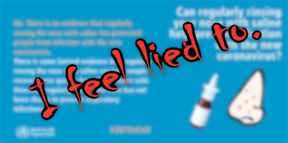

# WHO can gargle my ass.

Please note... I am not a doctor, so please take this with a \*grain of salt\*.

----

## Have You Considered Saline?

Back inc March 2020 I was thinking about how how to stop the spread. It occurred to me that if we can use effective gargling in a medical settings we might be able to prevent build up in nasal/mouth/throat before it gets enough to enter lungs and overwhelm immune system? May also help prevent/slow spread.

What did the World Health Organization say at the time?

> "Can regularly rinsing your nose with saline help prevent infection with the new coronavirus?
> No. There is no evidence that regularly rinsing the nose with saline has protected people from infection with the new coronavirus. 
> 
> There is some limited evidence that regularly rinsing nose with saline can help people recover more quickly from the common cold. However, regularly rinsing the nose has not been shown to prevent respiratory infections."
[Coronavirus disease (COVID-19) advice for the public: Myth busters](https://web.archive.org/web/20200312051930/https://who.int/emergencies/diseases/novel-coronavirus-2019/advice-for-public/myth-busters) [Archive: MAR 2020]

There is no evidence a preventative measure we haven't bothered to test at scale has effect? 🤨

Let's see. What did I dig up back then? (These are from tweets I made in March 2020) 

> "[salt] sodium chloride (NaCl). Replication of enveloped/non-enveloped, [...] RNA (respiratory syncytial virus, influenza A virus, human coronavirus 229E, coxsackievirus B3) viruses are inhibited in a dose-dependent manner."
> [Antiviral innate immune response in non-myeloid cells is augmented by chloride ions via an increase in intracellular hypochlorous acid levels](https://nature.com/articles/s41598-018-31936-y) [SEP 2018]

> "research project run by the University of Edinburgh initially showed last September that NaCL (sodium chloride) inhibited all types of viruses. The prevention of viruses is caused by the chloride component of salt, not the sodium."
> [Scientists believe salt could be cure to common cold](https://scotsman.com/regions/scientists-believe-salt-could-be-cure-common-cold-143758) [Jan 2019]

Here's a study on saline. ¯\\\_(ツ)\_/¯

> "Our study has limitations. As a pilot with a primary outcome of establishing if a trial using HSNIG is viable, the study is not powered for efficacy end-points. We hence need a larger trial to confirm our findings."
> [A pilot, open labelled, randomised controlled trial of hypertonic saline nasal irrigation and gargling for the common cold](https://www.ncbi.nlm.nih.gov/pmc/articles/PMC6355924/) [Jan 2019]

I found all sorts of content on iodized salt seeming to have an impact against viruses and viral infection somehow.

> "Formulations like [of povidone-iodine] antiseptic solution have demonstrated > 99.99% activity against both enveloped and non-enveloped viruses including Ebola, MERS, SARS coronavirus, influenza..."
> [Infectious Disease Management and Control with Povidone Iodine](https://link.springer.com/article/10.1007/s40121-019-00260-x) [AUG 2019]

Doesn't this count as evidence? I don't see how they can say with a straight face that there is \*no\* evidence any preventative measure we haven't bothered to test at scale has any effective power against "novel coronavirus".

And As far as I could tell there *is* evidence that salt water does have action against Coronavirus in general, and a low power clinical trial suggests it might work to lower the spread. We should have problbably done research here.

But I'm sure that this is just a *Myth*. Sure is awfully kind of the WHO to tell me that. /sarcasm

Tl;DR: No evidence my ass. 

How do we... Uh... Get access to a large number of potential cases to run a clinical trial on the use of salt water gargle as a partial preventative measure against contracting the common cold? You'd think cases would be hard to find... /sarcasm

----

Some time later... 

Now, to follow up on this idea in September 28th, 2023. Just in time to see a new rise in covid cases and concerns over spreading...

> [Ramalingam et al. revealed that increasing concentration of sodium chloride (NaCl) enhanced the antiviral activity of epithelial cells](https://www.nature.com/articles/s41598-018-31936-y) through inhibition of RNA and DNA viral replications including human coronavirus 229E35. However, this study found that the NaCl solution had no virucidal activity against SARS-CoV-2, even though high concentration of NaCl (0.34 M) was used. More study should be done using various NaCl concentrations to determine the effect of NaCl against SARS-CoV-2.
> [...]
> Nonetheless, this study and other recent studies showed that most commercially available mouthwash/gargle formulations were able to inactivate SARS-CoV-2. The most effective active ingredients are povidone-iodine17, benzylkonium chloride, essential oils28, cetylperidinium chloride and hexetidine.
> [The effectiveness of various gargle formulations and salt water against SARS-CoV-2](https://www.nature.com/articles/s41598-021-99866-w) [OCT 2021]

So that does imply that salt water is doing something to boost viral resistance and could help protect people. And more than that the overall study concluded that mouthwashing/gargle behaviors do indeed have virucidal activity. So we should probably encourage people to do that in a way that works.

And what happens if they actually try different concentrations? When this was investigated further it turns out the concentration of the salt is indeed a huge factor.

> "Our explanation of this intracellular response to the hypertonic solution was basic science but the findings of the study have evident applications in healthcare and clinical approaches to the management of various respiratory diseases," Ulrich said. "What we observed with regard to SARS-CoV-2 is likely to apply to other viruses as well, since the mechanism concerned is part of the host cell's response to infection."
> [Study reveals how saline solution can inhibit replication of SARS-CoV-2]( https://medicalxpress.com/news/2021-09-reveals-saline-solution-inhibit-replication.html) [SEP 2021]

Oh, and so.. uh.  What happens if you rinse your nose with a hypertonic solution of salt water like the WHO was really decrying?

Well consider this article in Forbes:

> "Participants in the study who performed nasal irrigation were more than eight times less likely to be hospitalized than the national rate. Only 1.3% of study participants who used nasal irrigation were hospitalized after testing positive for Covid-19. While 9.47% of Covid patients from a national CDC dataset who did not use nasal irrigation were hospitalized.
> Irrigating your sinuses is a simple practice anyone can implement at home using a neti pot, sinus rinse bottle, or syringe bulb available at a pharmacy or retailer like Target or Walmart. You can buy pre-made mixes or simply mix a half-teaspoon of salt and a half-teaspoon of baking soda in a cup of boiled and then cooled or distilled water. The water needs to be boiled or distilled to ensure it is sanitary. Many people often use these devices to clear up allergies, colds, or sinus infections." 
> [...] 
> Prior studies have also have found that saline can help combat COVID-19. A 2020 study shows that gargling with a saline-based solution can reduce viral load. A 2021 study suggests saline can be used as a “first-line intervention for COVID-19. The results of these studies suggests twice daily nasal irrigation is a safe, over-the-counter measure that can be used reduce disease severity. 
> [Saline Nasal Irrigation After Covid-19 Diagnosis Reduces Hospitalization](https://www.forbes.com/sites/williamhaseltine/2022/10/03/saline-nasal-irrigation-after-covid-19-diagnosis-reduces-hospitalization/?sh=737aaf92323c) [OCT 2022]

Which is citing these:

*  [Rapid initiation of nasal saline irrigation to reduce severity in high-risk COVID+ outpatients
](https://journals.sagepub.com/doi/10.1177/01455613221123737) [AUG 2022]
*  [A quadruple blind, randomised controlled trial of gargling agents in reducing intraoral viral load among hospitalised COVID-19 patients: A structured summary of a study protocol for a randomised controlled trial](https://pubmed.ncbi.nlm.nih.gov/32928313/) [SEP 2020]
*  [Essentials in saline pharmacology for nasal or respiratory hygiene in times of COVID-19](https://pubmed.ncbi.nlm.nih.gov/33772626/) [MAR 2021]

Do we have enough evidence yet?

Not sure about you, but I think its funny that [the WHO no longer has that bit on their website ([Archive: FEB 2022])](https://web.archive.org/web/20220210202445/https://www.who.int/emergencies/diseases/novel-coronavirus-2019/advice-for-public/myth-busters). You can still see how many other local health ministries in local municipalities parrot the old one as they blindly copied that text still say it though.

----

## Bad mythbusting backfires.

While myth-busting can combat misinformation, it can also backfire when used prematurely on complex, evolving topics. The WHO's goal is presumably to provide credible guidance, but their messaging here outpaced the available science.

Promoting it even just as a safe, accessible preventive measure worth exploring further would be a more scientifically balanced approach than an outright dismissal before the science is fully settled. Public health recommendations could reflect these complexities.

Calling it a "myth" without acknowledging these broader considerations is an oversimplification by the WHO. A more nuanced perspective would be to say the evidence for salt water directly combating SARS-CoV-2 specifically is still inconclusive or preliminary, while noting its potential value in other areas.

Even if salt water gargling proved ineffective specifically against SARS-CoV-2, it could still provide value by:

* Reducing the overall circulating levels and transmission of other common respiratory viruses through its potential antiviral effects. This could lessen the burden on the healthcare system from other illnesses.

* Being a very low-risk and low-cost practice with possible additional benefits beyond direct antiviral activity, such as reducing throat inflammation.

* Allowing more research time and data to be collected on its impact (or lack thereof) on SARS-CoV-2 and new variants before making a definitive conclusion. Dismissing it prematurely may close doors to further understanding.

Instead they chose to call it a lie. This strikes me as incompetence bordering on malice.

Calling something a "myth" has dismissive connotations that go beyond the scientific evidence. Some more constructive ways the WHO could have framed this issue include:

* Stating the evidence for salt water against SARS-CoV-2 is inconclusive/preliminary rather than definitive "no evidence".

* Acknowledging potential indirect benefits even if direct effect uncertain.

* Encouraging further research before making strong conclusions either way.

By prematurely labeling it a "myth", they risked:

* Discouraging promising research avenues that could aid public health.

* Diminishing public trust if/when evidence emerges that contradicts the original stance.

* Failing to consider broader context beyond just SARS-CoV-2 specifically.

## And the damage is done.

I don't trust the World Health Organization anymore. They jumped to conclusions without evidence and then as a trusted source of information they ended up spreading what amounts to lies and misinfo.

The other one I noticed they removed from their site was Garlic. I wonder how long until they remove the Hot Pepper one, cuz it turns out that taking hot pepper in your food may indirectly prevent coughs and could reduce the spread that way. But what do I know? I'm not a doctor.

> "Spices to Control COVID-19 Symptoms: Yes, but Not Only…"
>  
> "Nrf2-TRPA1/V1 agonists may have some relevance for the treatment of persistent cough following viral infections [54, 55, 56], both in nonallergic rhinitis [57, 58], and also possibly in some symptoms of the common cold. We do however urgently need to go from empiricism to science with appropriate mechanistic and clinical studies."
>  [DEC 2020]

While the WHO's aim is presumably to combat misinformation, the messaging here at the time did not align well with the nuanced realities of an evolving scientific issue. A more cautious, evidence-based framing allowing for uncertainties could have avoided perceptions of incompetence or worse. Their current framing was and still is counterproductive and risks undermining their credibility on Covid advice going forward. A correction or clarification may be warranted.

The WHO calling salt water gargling a myth early in the pandemic likely led to that idea being dismissed or seen as debunked in many people's minds. Even though they no longer have that on their website, the myth label probably still shapes perceptions for some who aren't closely following the evolving research.

This illustrates how authoritative sources like WHO need to be very judicious and nuanced when communicating about new or uncertain scientific issues to the public. Simplistic myth busting can inadvertently entrench misconceptions if the evidence later shifts. It can undermine trust in future guidance too.

----

So like I said, take this idea with a grain of salt. In fact aim for a hypertonic level of salt. And be sure to use boiled water if you plan on washing your nose. I hear it stops things from smelling like bullshit.
